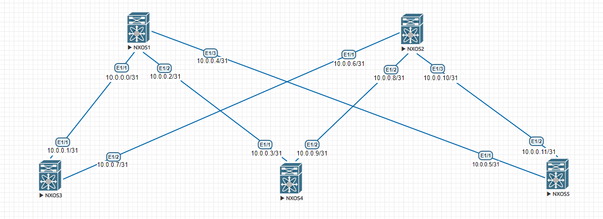

#   Проектирование адресного пространства

### Цели:
    Собрать схему CLOS из 5 коммутаторов Nexus 9k;
    Распределить адресное пространство;

### Решение:


###### План работы:

Задокументировать адресное пространство
Соединить коммутаторы линками по топологии clos
Настроить link интерфейсы
Проверить доступность connected интерфейсов 


## Документация адресного пространства
1. Сеть для loopback интерфейсов 192.168.0.0/24
2. Сеть для линковых интерфейсов 10.0.0.0/24
3. Сеть клиентов 172.16.0.0/24

## Схема




## Конфигурация линковых интерфейсов

 
Интерфейсы MSW01:
```
interface Ethernet1/1
  no switchport
  ip address 10.0.0.0/31
  no shutdown

interface Ethernet1/2
  no switchport
  ip address 10.0.0.2/31
  no shutdown

interface Ethernet1/3
  no switchport
  ip address 10.0.0.4/31
  no shutdown
```
Интерфейсы MSW02:
```
interface Ethernet1/1
  no switchport
  ip address 10.0.0.6/31
  no shutdown

interface Ethernet1/2
  no switchport
  ip address 10.0.0.8/31
  no shutdown

interface Ethernet1/3
  no switchport
  ip address 10.0.0.10/31
  no shutdown
```

Интерфейсы LSW01:
```
interface Ethernet1/1
  no switchport
  ip address 10.0.0.1/31
  no shutdown

interface Ethernet1/2
  no switchport
  ip address 10.0.0.7/31
  no shutdown
```
Интерфейсы LSW02:
```
interface Ethernet1/1
  no switchport
  ip address 10.0.0.3/31
  no shutdown

interface Ethernet1/2
  no switchport
  ip address 10.0.0.9/31
  no shutdown
```

Интерфейсы LSW03:
```
interface Ethernet1/1
  no switchport
  ip address 10.0.0.5/31
  no shutdown

interface Ethernet1/2
  no switchport
  ip address 10.0.0.11/31
  no shutdown
```

### Проверка доступности connected интерфейсов

```
MSW01# ping 10.0.0.1
PING 10.0.0.1 (10.0.0.1): 56 data bytes
36 bytes from 10.0.0.0: Destination Host Unreachable
Request 0 timed out
64 bytes from 10.0.0.1: icmp_seq=1 ttl=254 time=72.581 ms
64 bytes from 10.0.0.1: icmp_seq=2 ttl=254 time=20.615 ms
64 bytes from 10.0.0.1: icmp_seq=3 ttl=254 time=9.977 ms
64 bytes from 10.0.0.1: icmp_seq=4 ttl=254 time=17.858 ms

--- 10.0.0.1 ping statistics ---
5 packets transmitted, 4 packets received, 20.00% packet loss
round-trip min/avg/max = 9.977/30.257/72.581 ms
MSW01# 

MSW01# ping 10.0.0.3
PING 10.0.0.3 (10.0.0.3): 56 data bytes
36 bytes from 10.0.0.2: Destination Host Unreachable
Request 0 timed out
64 bytes from 10.0.0.3: icmp_seq=1 ttl=254 time=57.792 ms
64 bytes from 10.0.0.3: icmp_seq=2 ttl=254 time=11.312 ms
64 bytes from 10.0.0.3: icmp_seq=3 ttl=254 time=11.515 ms
64 bytes from 10.0.0.3: icmp_seq=4 ttl=254 time=11.98 ms

--- 10.0.0.3 ping statistics ---
5 packets transmitted, 4 packets received, 20.00% packet loss
round-trip min/avg/max = 11.312/23.149/57.792 ms
MSW01# 

MSW01# ping 10.0.0.5
PING 10.0.0.5 (10.0.0.5): 56 data bytes
36 bytes from 10.0.0.4: Destination Host Unreachable
Request 0 timed out
64 bytes from 10.0.0.5: icmp_seq=1 ttl=254 time=49.392 ms
64 bytes from 10.0.0.5: icmp_seq=2 ttl=254 time=7.981 ms
64 bytes from 10.0.0.5: icmp_seq=3 ttl=254 time=7.201 ms
64 bytes from 10.0.0.5: icmp_seq=4 ttl=254 time=15.409 ms

--- 10.0.0.5 ping statistics ---
5 packets transmitted, 4 packets received, 20.00% packet loss
round-trip min/avg/max = 7.201/19.995/49.392 ms
MSW01#


MSW02# ping 10.0.0.7
PING 10.0.0.7 (10.0.0.7): 56 data bytes
36 bytes from 10.0.0.6: Destination Host Unreachable
Request 0 timed out
64 bytes from 10.0.0.7: icmp_seq=1 ttl=254 time=42.811 ms
64 bytes from 10.0.0.7: icmp_seq=2 ttl=254 time=7.053 ms
64 bytes from 10.0.0.7: icmp_seq=3 ttl=254 time=6.278 ms
64 bytes from 10.0.0.7: icmp_seq=4 ttl=254 time=7.989 ms

--- 10.0.0.7 ping statistics ---
5 packets transmitted, 4 packets received, 20.00% packet loss
round-trip min/avg/max = 6.278/16.032/42.811 ms

MSW02# ping 10.0.0.9
PING 10.0.0.9 (10.0.0.9): 56 data bytes
36 bytes from 10.0.0.8: Destination Host Unreachable
Request 0 timed out
64 bytes from 10.0.0.9: icmp_seq=1 ttl=254 time=129.493 ms
64 bytes from 10.0.0.9: icmp_seq=2 ttl=254 time=21.869 ms
64 bytes from 10.0.0.9: icmp_seq=3 ttl=254 time=13.838 ms
64 bytes from 10.0.0.9: icmp_seq=4 ttl=254 time=46.999 ms

--- 10.0.0.9 ping statistics ---
5 packets transmitted, 4 packets received, 20.00% packet loss
round-trip min/avg/max = 13.838/53.049/129.493 ms
MSW02# 

MSW02# ping 10.0.0.11
PING 10.0.0.11 (10.0.0.11): 56 data bytes
36 bytes from 10.0.0.10: Destination Host Unreachable
Request 0 timed out
64 bytes from 10.0.0.11: icmp_seq=1 ttl=254 time=149.037 ms
64 bytes from 10.0.0.11: icmp_seq=2 ttl=254 time=31.4 ms
64 bytes from 10.0.0.11: icmp_seq=3 ttl=254 time=17.611 ms
64 bytes from 10.0.0.11: icmp_seq=4 ttl=254 time=17.089 ms

--- 10.0.0.11 ping statistics ---
5 packets transmitted, 4 packets received, 20.00% packet loss
round-trip min/avg/max = 17.089/53.784/149.037 ms
MSW02# 
```