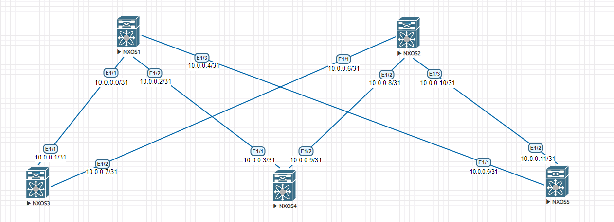

## Underlay. IS-IS

## Цели:

1. Настроить IS-IS в Underlay сети, для IP связанности между всеми устройствами.

## Документация адресного пространства
1. Сеть для loopback интерфейсов 1.1.0.0/23
2. Сеть для линковых интерфейсов 10.0.0.0/24
3. Сеть клиентов 172.16.0.0/24

## Схема:

### Решение:

1. Выключить OSPF глобально.
2. Включить feature ISIS и создать процесс ISIS.
3. Настроить net(00.0000.0000.0000.0000.00) где 00 это AFI для IP сетей = 49,
затем идёт ID area(2 байта), RID(4 байта,в нашем случае это отформатированные адреса лупбеков) - например
для SSW01 с адресом 1.1.0.1 RID будет 0010.0100.0001, затем добавляем в конце .00 . Итого получается
49.0001.0010.0100.0001.00.
4. Включить ISIS на всех линках. Выбор типа маршрутизатора оставляем по умолчанию - L1/L2.
Все маршрутизаторы будут строить L1 соседства, т.к. все находятся в одной area.

### Проверка:

1. Проверка доступности интерефейсов коммандой ping.

SSW01# ping 10.0.0.1
PING 10.0.0.1 (10.0.0.1): 56 data bytes
64 bytes from 10.0.0.1: icmp_seq=0 ttl=254 time=7.973 ms
64 bytes from 10.0.0.1: icmp_seq=1 ttl=254 time=4.571 ms
64 bytes from 10.0.0.1: icmp_seq=2 ttl=254 time=6.59 ms
64 bytes from 10.0.0.1: icmp_seq=3 ttl=254 time=4.352 ms
64 bytes from 10.0.0.1: icmp_seq=4 ttl=254 time=6.421 ms

--- 10.0.0.1 ping statistics ---
5 packets transmitted, 5 packets received, 0.00% packet loss
round-trip min/avg/max = 4.352/5.981/7.973 ms
SSW01# ping 10.0.0.3
PING 10.0.0.3 (10.0.0.3): 56 data bytes
64 bytes from 10.0.0.3: icmp_seq=0 ttl=254 time=7.506 ms
64 bytes from 10.0.0.3: icmp_seq=1 ttl=254 time=5.221 ms
64 bytes from 10.0.0.3: icmp_seq=2 ttl=254 time=5.347 ms
64 bytes from 10.0.0.3: icmp_seq=3 ttl=254 time=4.77 ms
64 bytes from 10.0.0.3: icmp_seq=4 ttl=254 time=5.992 ms

--- 10.0.0.3 ping statistics ---
5 packets transmitted, 5 packets received, 0.00% packet loss
round-trip min/avg/max = 4.77/5.767/7.506 ms
SSW01# ping 10.0.0.5
PING 10.0.0.5 (10.0.0.5): 56 data bytes
64 bytes from 10.0.0.5: icmp_seq=0 ttl=254 time=8.764 ms
64 bytes from 10.0.0.5: icmp_seq=1 ttl=254 time=13.425 ms
64 bytes from 10.0.0.5: icmp_seq=2 ttl=254 time=5.97 ms
64 bytes from 10.0.0.5: icmp_seq=3 ttl=254 time=6.158 ms
64 bytes from 10.0.0.5: icmp_seq=4 ttl=254 time=16.195 ms

--- 10.0.0.5 ping statistics ---
5 packets transmitted, 5 packets received, 0.00% packet loss
round-trip min/avg/max = 5.97/10.102/16.195 ms
SSW01# ping 10.0.0.6
PING 10.0.0.6 (10.0.0.6): 56 data bytes
64 bytes from 10.0.0.6: icmp_seq=0 ttl=253 time=15.063 ms
64 bytes from 10.0.0.6: icmp_seq=1 ttl=253 time=10.37 ms
64 bytes from 10.0.0.6: icmp_seq=2 ttl=253 time=9.923 ms
64 bytes from 10.0.0.6: icmp_seq=3 ttl=253 time=8.613 ms
64 bytes from 10.0.0.6: icmp_seq=4 ttl=253 time=8.886 ms

--- 10.0.0.6 ping statistics ---
5 packets transmitted, 5 packets received, 0.00% packet loss
round-trip min/avg/max = 8.613/10.571/15.063 ms
SSW01# ping 10.0.0.7
PING 10.0.0.7 (10.0.0.7): 56 data bytes
64 bytes from 10.0.0.7: icmp_seq=0 ttl=254 time=8.954 ms
64 bytes from 10.0.0.7: icmp_seq=1 ttl=254 time=7.27 ms
64 bytes from 10.0.0.7: icmp_seq=2 ttl=254 time=8.018 ms
64 bytes from 10.0.0.7: icmp_seq=3 ttl=254 time=7.766 ms
64 bytes from 10.0.0.7: icmp_seq=4 ttl=254 time=6.023 ms

--- 10.0.0.7 ping statistics ---
5 packets transmitted, 5 packets received, 0.00% packet loss
round-trip min/avg/max = 6.023/7.606/8.954 ms
SSW01# ping 10.0.0.8
PING 10.0.0.8 (10.0.0.8): 56 data bytes
64 bytes from 10.0.0.8: icmp_seq=0 ttl=253 time=12.918 ms
64 bytes from 10.0.0.8: icmp_seq=1 ttl=253 time=10.658 ms
64 bytes from 10.0.0.8: icmp_seq=2 ttl=253 time=13.641 ms
64 bytes from 10.0.0.8: icmp_seq=3 ttl=253 time=11.255 ms
64 bytes from 10.0.0.8: icmp_seq=4 ttl=253 time=9.03 ms

--- 10.0.0.8 ping statistics ---
5 packets transmitted, 5 packets received, 0.00% packet loss
round-trip min/avg/max = 9.03/11.5/13.641 ms
SSW01# ping 10.0.0.9
^[[APING 10.0.0.9 (10.0.0.9): 56 data bytes
64 bytes from 10.0.0.9: icmp_seq=0 ttl=254 time=11.741 ms
64 bytes from 10.0.0.9: icmp_seq=1 ttl=254 time=15.697 ms
64 bytes from 10.0.0.9: icmp_seq=2 ttl=254 time=8.483 ms
64 bytes from 10.0.0.9: icmp_seq=3 ttl=254 time=5.889 ms
64 bytes from 10.0.0.9: icmp_seq=4 ttl=254 time=6.862 ms

--- 10.0.0.9 ping statistics ---
5 packets transmitted, 5 packets received, 0.00% packet loss
round-trip min/avg/max = 5.889/9.734/15.697 ms
SSW01# ping 10.0.0.10
PING 10.0.0.10 (10.0.0.10): 56 data bytes
64 bytes from 10.0.0.10: icmp_seq=0 ttl=253 time=16.367 ms
64 bytes from 10.0.0.10: icmp_seq=1 ttl=253 time=9.866 ms
64 bytes from 10.0.0.10: icmp_seq=2 ttl=253 time=8.372 ms
64 bytes from 10.0.0.10: icmp_seq=3 ttl=253 time=11.766 ms
64 bytes from 10.0.0.10: icmp_seq=4 ttl=253 time=11.07 ms

--- 10.0.0.10 ping statistics ---
5 packets transmitted, 5 packets received, 0.00% packet loss
round-trip min/avg/max = 8.372/11.488/16.367 ms
SSW01# ping 10.0.0.11
PING 10.0.0.11 (10.0.0.11): 56 data bytes
64 bytes from 10.0.0.11: icmp_seq=0 ttl=254 time=8.426 ms
64 bytes from 10.0.0.11: icmp_seq=1 ttl=254 time=6.483 ms
64 bytes from 10.0.0.11: icmp_seq=2 ttl=254 time=4.823 ms
64 bytes from 10.0.0.11: icmp_seq=3 ttl=254 time=5.281 ms
64 bytes from 10.0.0.11: icmp_seq=4 ttl=254 time=5.086 ms

--- 10.0.0.11 ping statistics ---
5 packets transmitted, 5 packets received, 0.00% packet loss
round-trip min/avg/max = 4.823/6.019/8.426 ms
SSW01#

2. Выгрузка таблицы маршрутизации SSW01:

LSW01(config-router)# show ip route
IP Route Table for VRF "default"
'*' denotes best ucast next-hop
'**' denotes best mcast next-hop
'[x/y]' denotes [preference/metric]
'%<string>' in via output denotes VRF <string>

10.0.0.0/31, ubest/mbest: 1/0, attached
    *via 10.0.0.1, Eth1/1, [0/0], 1w1d, direct
10.0.0.1/32, ubest/mbest: 1/0, attached
    *via 10.0.0.1, Eth1/1, [0/0], 1w1d, local
10.0.0.2/31, ubest/mbest: 1/0
    *via 10.0.0.0, Eth1/1, [115/80], 00:02:57, isis-underlay, L1
10.0.0.4/31, ubest/mbest: 1/0
    *via 10.0.0.0, Eth1/1, [115/80], 00:02:57, isis-underlay, L1
10.0.0.6/31, ubest/mbest: 1/0, attached
    *via 10.0.0.7, Eth1/2, [0/0], 1w1d, direct
10.0.0.7/32, ubest/mbest: 1/0, attached
    *via 10.0.0.7, Eth1/2, [0/0], 1w1d, local
10.0.0.8/31, ubest/mbest: 1/0
    *via 10.0.0.6, Eth1/2, [115/80], 00:02:54, isis-underlay, L1
10.0.0.10/31, ubest/mbest: 1/0
    *via 10.0.0.6, Eth1/2, [115/80], 00:02:54, isis-underlay, L1

LSW01(config-router)#
