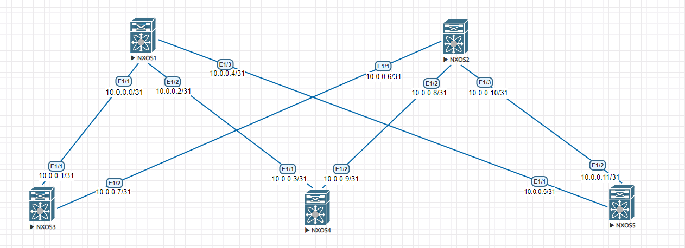

## Underlay. eBGP


## Цели:
Настроить BGP в Underlay сети, для IP связанности между всеми устройствами.


## Документация адресного пространства
1. Сеть для loopback интерфейсов 1.1.0.0/23
2. Сеть для линковых интерфейсов 10.0.0.0/24
3. Сеть клиентов 172.16.0.0/24

## Схема:



### Решение:
1. Удаление следовов конфигурации протоколов IGP для удобства администрирования
2. Включаем feature BGP и создадаём процессы BGP на каждом коммутаторе, spine коммутаторы будут в одной AS,
leaf коммутаторы в разных.
3. На каждом коммутаторе настроим router id равный значению IP лупбек интерфейса
каждого коммутатора.
4. Меняем дефолтные таймеры BGP для ускорения сходимости.
5. Включаем multipath-relax для импорта ECMP маршрутов с неодинаковыми номерами AS в AS-path
6. Создаём AF для IPv4 маршрутов.
7. Добавляем в AF IPv4 анонс адресов лупбек интерфейсов и включаем возможность импорта
равноценных маршрутов в RIB.
8. Добавляем BGP соседей: 1. Для spine коммутаторов настроена подсеть, в которой
коммутаторы будут слушать BGP запросы, а так же роутмап с перечнем AS, с которыми можно
устанавливать соседство. 2. Для leaf коммутаторов указываем в качестве соседей оба спайна статически


### Проверка:


Проверяем, что нужные маршруты инсталируются в RIB:
````
SW01# show ip route
IP Route Table for VRF "default"
'*' denotes best ucast next-hop
'**' denotes best mcast next-hop
'[x/y]' denotes [preference/metric]
'%<string>' in via output denotes VRF <string>

1.1.0.1/32, ubest/mbest: 1/0
    *via 10.0.0.1, [20/0], 4d09h, bgp-65000, external, tag 65001
1.1.0.2/32, ubest/mbest: 1/0
    *via 10.0.0.3, [20/0], 4d10h, bgp-65000, external, tag 65002
1.1.0.3/32, ubest/mbest: 1/0
    *via 10.0.0.5, [20/0], 4d10h, bgp-65000, external, tag 65003
1.1.1.1/32, ubest/mbest: 2/0, attached
    *via 1.1.1.1, Lo0, [0/0], 4d12h, local
    *via 1.1.1.1, Lo0, [0/0], 4d12h, direct
10.0.0.0/31, ubest/mbest: 1/0, attached
    *via 10.0.0.0, Eth1/1, [0/0], 4d12h, direct
10.0.0.0/32, ubest/mbest: 1/0, attached
    *via 10.0.0.0, Eth1/1, [0/0], 4d12h, local
10.0.0.2/31, ubest/mbest: 1/0, attached
    *via 10.0.0.2, Eth1/2, [0/0], 4d12h, direct
10.0.0.2/32, ubest/mbest: 1/0, attached
    *via 10.0.0.2, Eth1/2, [0/0], 4d12h, local
10.0.0.4/31, ubest/mbest: 1/0, attached
    *via 10.0.0.4, Eth1/3, [0/0], 4d12h, direct
10.0.0.4/32, ubest/mbest: 1/0, attached
    *via 10.0.0.4, Eth1/3, [0/0], 4d12h, local

SSW01#
SSW02# show ip route
IP Route Table for VRF "default"
'*' denotes best ucast next-hop
'**' denotes best mcast next-hop
'[x/y]' denotes [preference/metric]
'%<string>' in via output denotes VRF <string>

1.1.0.1/32, ubest/mbest: 1/0
    *via 10.0.0.7, [20/0], 4d09h, bgp-65000, external, tag 65001
1.1.0.2/32, ubest/mbest: 1/0
    *via 10.0.0.9, [20/0], 4d11h, bgp-65000, external, tag 65002
1.1.0.3/32, ubest/mbest: 1/0
    *via 10.0.0.11, [20/0], 4d10h, bgp-65000, external, tag 65003
1.1.1.2/32, ubest/mbest: 2/0, attached
    *via 1.1.1.2, Lo0, [0/0], 4d11h, local
    *via 1.1.1.2, Lo0, [0/0], 4d11h, direct
10.0.0.6/31, ubest/mbest: 1/0, attached
    *via 10.0.0.6, Eth1/1, [0/0], 4d11h, direct
10.0.0.6/32, ubest/mbest: 1/0, attached
    *via 10.0.0.6, Eth1/1, [0/0], 4d11h, local
10.0.0.8/31, ubest/mbest: 1/0, attached
    *via 10.0.0.8, Eth1/2, [0/0], 4d11h, direct
10.0.0.8/32, ubest/mbest: 1/0, attached
    *via 10.0.0.8, Eth1/2, [0/0], 4d11h, local
10.0.0.10/31, ubest/mbest: 1/0, attached
    *via 10.0.0.10, Eth1/3, [0/0], 4d11h, direct
10.0.0.10/32, ubest/mbest: 1/0, attached
    *via 10.0.0.10, Eth1/3, [0/0], 4d11h, local

SSW02#
````


