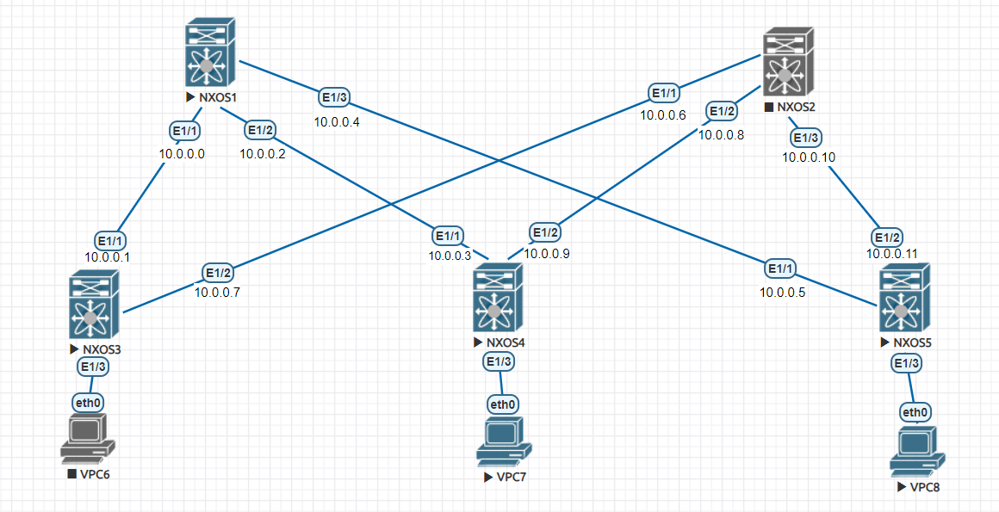

## Underlay. eBGP


## Цели:
Настроить BGP в Underlay сети, для IP связанности между всеми устройствами.


## Документация адресного пространства
1. Сеть loopback интерфейсов 1.1.0.0/23 для overlay BGP апдейтов
2. Сеть loopback интерфейсов 1.1.2.0/23 для vtep
3. Сеть для линковых интерфейсов 10.0.0.0/24
4. Сеть клиентов в Vlan10 172.16.1.0/24. 
5. Сеть клиентов в Vlan20 172.16.2.0/24
6. Сеть клиентов в Vlan30 172.16.3.0/24

## Схема:



### Решение:
1. На каждом коммутаторе создаём лупбек интерфейсы для vtep эндпоинтов и анонсим их по BGP
2. На спайн коммутаторе включаем автообноружение BGP соседей в сети 1.1.0.0/23.
3. В настройках диапазона соседей для автообноружения задаём сорс интерефейсом для bgp ап-
дейтов loopback0
4. Создаём address-family l2vpn evpn и включаем в нём отправку расширенного комьюнити для возможности анонсов BGP EVPN VXLAN.
5. Со стороны leaf коммутаторов создаём NVE интерфейсы для (ин/де)капсуляции vxlan заголовков
В настройках в качестве source interface выбираем лупбеки из сети с vtep endpoint.
Мапим к интерфейсу наш VNI для пробрасываемой сети и указываем тип обмена широковещательным трафиком ingress replication 
6. В настройках BGP на leaf создаём по 2 соседа на новых лупбеках, которые анонсили по
BGP в underlay сети(настройки как на spine, но включаем multihob, т.к. на самом деле их больше 1).
Добавляем в BGP секцию инструкции по работе с VNI(указываем его тип и его адреса RT и RD)
7. Ассоцируем VLAN 10 c VNI 10010


### Проверка:


Проверяем, что нужные маршруты инсталируются в RIB:
````
SSW01# show bgp l2vpn evpn
BGP routing table information for VRF default, address family L2VPN EVPN
BGP table version is 22, Local Router ID is 1.1.1.1
Status: s-suppressed, x-deleted, S-stale, d-dampened, h-history, *-valid, >-best
Path type: i-internal, e-external, c-confed, l-local, a-aggregate, r-redist, I-i
njected
Origin codes: i - IGP, e - EGP, ? - incomplete, | - multipath, & - backup, 2 - b
est2

   Network            Next Hop            Metric     LocPrf     Weight Path
Route Distinguisher: 1.1.2.2:10
*>e[2]:[0]:[0]:[48]:[0050.7966.6807]:[0]:[0.0.0.0]/216
                      1.1.2.2                                        0 65002 i
*>e[3]:[0]:[32]:[1.1.2.2]/88
                      1.1.2.2                                        0 65002 i

Route Distinguisher: 1.1.2.3:10
*>e[2]:[0]:[0]:[48]:[0050.7966.6808]:[0]:[0.0.0.0]/216
                      1.1.2.3                                        0 65003 i
*>e[3]:[0]:[32]:[1.1.2.3]/88
                      1.1.2.3                                        0 65003 i

SSW01#

Со стороны подключённых PC видны ARP записи из разшаренной сети:
VPCS> arp

00:50:79:66:68:08  172.16.1.3 expires in 112 seconds

VPCS> arp

00:50:79:66:68:07  172.16.1.2 expires in 113 seconds


````


