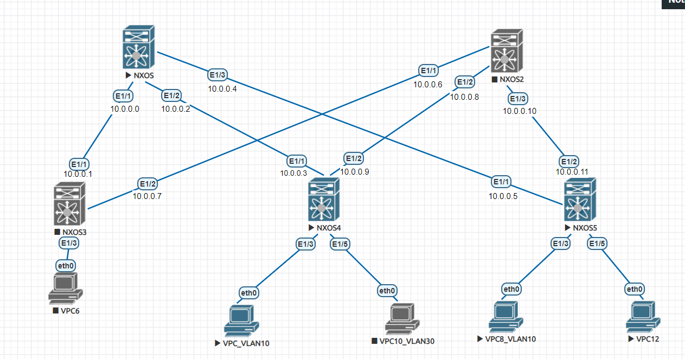

## Underlay. eBGP


## Цели:
Настроить L3 связность  по VxLAN EVPN L3 по модели симметричного IRB для связи
клиентов в VLAN 10 и VLAN 30, подключённых к разным leaf коммутаторам. Клиенты
разных сетей в рамках одного коммутатора так же должны быть доступны.


## Документация адресного пространства
1. Сеть loopback интерфейсов 1.1.0.0/23 для overlay BGP апдейтов
2. Сеть loopback интерфейсов 1.1.2.0/23 для vtep
3. Сеть для линковых интерфейсов 10.0.0.0/24
4. Сеть клиентов в Vlan10 172.16.1.0/24. 
5. Сеть клиентов в Vlan20 172.16.2.0/24
6. Сеть клиентов в Vlan30 172.16.3.0/24

## Схема:



### Решение:
1. Создаём для новых сетей пользователей виланы и мапим их к vni сегментам. Так же
создаём VLAN для транспортного L3VNI.
2. Для маршрутизации из локальных сетей клиентов в транспортный l3vni создаём vrf,
мапим к нему соответствующий VNI, RD и RT. Порядок назначения RT ASN:VNI, по аналогии
с автонастройкой.
3. Выделяем память для работы arp supression(и, как выяснилось, форвардинга трафика)
4. Создадим интерфейсы с шлюзами для сетей клиентов. Для возможности переезда 
виртуалок, без изменения настроек, создадим anycast GW c общим маком 0000.0000.0100.
Каждый интерфейс клиентов добавляем в vrf l3vni, включаем arp supression.
5. Создаём интерфейс для транспортного VNI, IP настраивать не нужно, передача трафика
будет происходить за счёт комманды ip forward
6. На интерфейс NVE1 добавляем новые vni клиентов и транспортный vni(ассоциируем его с vrf)
7. Добавляем в BGP vrf с evpn маршрутами и включаем анонс AF IPv4.


### Проверка:

1. Проверяем, что хосты за разными leaf в разных сетях пингуют друг друга:
````
VPCS> show ip

NAME        : VPCS[1]
IP/MASK     : 172.16.3.30/24
GATEWAY     : 172.16.3.254
DNS         :
MAC         : 00:50:79:66:68:0c
LPORT       : 20000
RHOST:PORT  : 127.0.0.1:30000
MTU         : 1500

VPCS> ping 172.16.1.10

172.16.1.10 icmp_seq=1 timeout
172.16.1.10 icmp_seq=2 timeout
172.16.1.10 icmp_seq=3 timeout
172.16.1.10 icmp_seq=4 timeout
172.16.1.10 icmp_seq=5 timeout

VPCS> ping 172.16.1.11

84 bytes from 172.16.1.11 icmp_seq=1 ttl=63 time=6.373 ms
84 bytes from 172.16.1.11 icmp_seq=2 ttl=63 time=5.586 ms
84 bytes from 172.16.1.11 icmp_seq=3 ttl=63 time=7.750 ms
84 bytes from 172.16.1.11 icmp_seq=4 ttl=63 time=3.839 ms
84 bytes from 172.16.1.11 icmp_seq=5 ttl=63 time=5.301 ms


VPCS> ping 172.16.1.10

host (172.16.1.10) not reachable

VPCS> show ip

NAME        : VPCS[1]
IP/MASK     : 172.16.1.11/24
GATEWAY     : 172.16.1.254
DNS         :
MAC         : 00:50:79:66:68:08
LPORT       : 20000
RHOST:PORT  : 127.0.0.1:30000
MTU         : 1500

VPCS> ping 172.16.3.30

84 bytes from 172.16.3.30 icmp_seq=1 ttl=63 time=10.297 ms
84 bytes from 172.16.3.30 icmp_seq=2 ttl=63 time=4.190 ms
84 bytes from 172.16.3.30 icmp_seq=3 ttl=63 time=9.882 ms
84 bytes from 172.16.3.30 icmp_seq=4 ttl=63 time=6.644 ms
84 bytes from 172.16.3.30 icmp_seq=5 ttl=63 time=4.784 ms
````

В таблице BGP l2vpn видны соответствующие маршруты и arp записи.
````
LSW03# show bgp l2vpn evpn
BGP routing table information for VRF default, address family L2VPN EVPN
BGP table version is 52, Local Router ID is 1.1.0.3
Status: s-suppressed, x-deleted, S-stale, d-dampened, h-history, *-valid, >-best
Path type: i-internal, e-external, c-confed, l-local, a-aggregate, r-redist, I-i
njected
Origin codes: i - IGP, e - EGP, ? - incomplete, | - multipath, & - backup, 2 - b
est2

   Network            Next Hop            Metric     LocPrf     Weight Path
Route Distinguisher: 1.1.2.3:10    (L2VNI 10010)
*>l[2]:[0]:[0]:[48]:[0050.7966.6808]:[0]:[0.0.0.0]/216
                      1.1.2.3                           100      32768 i
*>l[2]:[0]:[0]:[48]:[0050.7966.6808]:[32]:[172.16.1.11]/248
                      1.1.2.3                           100      32768 i
*>l[3]:[0]:[32]:[1.1.2.3]/88
                      1.1.2.3                           100      32768 i

Route Distinguisher: 1.1.2.3:20    (L2VNI 10020)
*>l[3]:[0]:[32]:[1.1.2.3]/88
                      1.1.2.3                           100      32768 i

Route Distinguisher: 1.1.2.3:30    (L2VNI 10030)
*>l[2]:[0]:[0]:[48]:[0050.7966.680c]:[0]:[0.0.0.0]/216
                      1.1.2.3                           100      32768 i
*>l[2]:[0]:[0]:[48]:[0050.7966.680c]:[32]:[172.16.3.30]/248
                      1.1.2.3                           100      32768 i
*>l[3]:[0]:[32]:[1.1.2.3]/88
                      1.1.2.3                           100      32768 i
````


