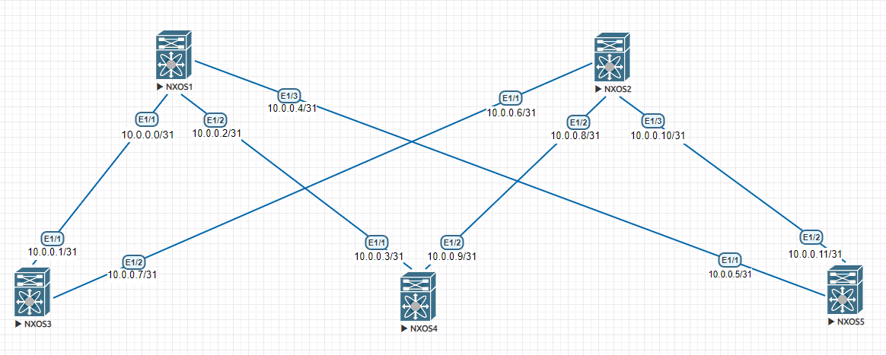

## Underlay. OSPF


### Цели:
    Организовать связь по IP между всеми узлами в сети путём настройки протокола маршрутизации OSPF.
    
Решение:

1. Создать процесс OSPF и добавить в него нужные интерфейсы.
2. ~~Настроить BFD на OSPF линках~~

Схема:




Типовая конфигурация коммутатора на примере SSW01:
```
interface Ethernet1/1
  no switchport
  medium p2p
  ip address 10.0.0.0/31
  no ip ospf passive-interface
  ip router ospf underlay area 0.0.0.0
  no shutdown

interface Ethernet1/2
  no switchport
  medium p2p
  ip address 10.0.0.2/31
  no ip ospf passive-interface
  ip router ospf underlay area 0.0.0.0
  no shutdown

interface Ethernet1/3
  no switchport
  medium p2p
  ip address 10.0.0.4/31
  no ip ospf passive-interface
  ip router ospf underlay area 0.0.0.0
  no shutdown

router ospf underlay
  router-id 1.1.0.1
  passive-interface default
```

### Проверки доступности сетей командой ping
```
SSW01# ping 10.0.0.1 count 2
PING 10.0.0.1 (10.0.0.1): 56 data bytes
64 bytes from 10.0.0.1: icmp_seq=0 ttl=254 time=32.577 ms
64 bytes from 10.0.0.1: icmp_seq=1 ttl=254 time=8.46 ms

--- 10.0.0.1 ping statistics ---
2 packets transmitted, 2 packets received, 0.00% packet loss
round-trip min/avg/max = 8.46/20.518/32.577 ms
SSW01# ping 10.0.0.3 count 2
PING 10.0.0.3 (10.0.0.3): 56 data bytes
64 bytes from 10.0.0.3: icmp_seq=0 ttl=254 time=23.263 ms
64 bytes from 10.0.0.3: icmp_seq=1 ttl=254 time=6.556 ms

--- 10.0.0.3 ping statistics ---
2 packets transmitted, 2 packets received, 0.00% packet loss
round-trip min/avg/max = 6.556/14.909/23.263 ms
SSW01# ping 10.0.0.5 count 2
PING 10.0.0.5 (10.0.0.5): 56 data bytes
64 bytes from 10.0.0.5: icmp_seq=0 ttl=254 time=17.87 ms
64 bytes from 10.0.0.5: icmp_seq=1 ttl=254 time=10.836 ms

--- 10.0.0.5 ping statistics ---
2 packets transmitted, 2 packets received, 0.00% packet loss
round-trip min/avg/max = 10.836/14.352/17.87 ms
SSW01# ping 10.0.0.7 count 2
PING 10.0.0.7 (10.0.0.7): 56 data bytes
64 bytes from 10.0.0.7: icmp_seq=0 ttl=254 time=8.366 ms
64 bytes from 10.0.0.7: icmp_seq=1 ttl=254 time=12.699 ms

--- 10.0.0.7 ping statistics ---
2 packets transmitted, 2 packets received, 0.00% packet loss
round-trip min/avg/max = 8.366/10.532/12.699 ms
SSW01# ping 10.0.0.9 count 2
PING 10.0.0.9 (10.0.0.9): 56 data bytes
64 bytes from 10.0.0.9: icmp_seq=0 ttl=254 time=29.033 ms
64 bytes from 10.0.0.9: icmp_seq=1 ttl=254 time=8.455 ms

--- 10.0.0.9 ping statistics ---
2 packets transmitted, 2 packets received, 0.00% packet loss
round-trip min/avg/max = 8.455/18.743/29.033 ms
SSW01# ping 10.0.0.11 count 2
PING 10.0.0.11 (10.0.0.11): 56 data bytes
64 bytes from 10.0.0.11: icmp_seq=0 ttl=254 time=10.133 ms
64 bytes from 10.0.0.11: icmp_seq=1 ttl=254 time=17.402 ms

--- 10.0.0.11 ping statistics ---
2 packets transmitted, 2 packets received, 0.00% packet loss
round-trip min/avg/max = 10.133/13.767/17.402 ms
SSW01# ping 10.0.0.6 count 2
PING 10.0.0.6 (10.0.0.6): 56 data bytes
64 bytes from 10.0.0.6: icmp_seq=0 ttl=253 time=35.262 ms
64 bytes from 10.0.0.6: icmp_seq=1 ttl=253 time=27.338 ms

--- 10.0.0.6 ping statistics ---
2 packets transmitted, 2 packets received, 0.00% packet loss
round-trip min/avg/max = 27.338/31.3/35.262 ms
SSW01# ping 10.0.0.8 count 2
PING 10.0.0.8 (10.0.0.8): 56 data bytes
64 bytes from 10.0.0.8: icmp_seq=0 ttl=253 time=18.174 ms
64 bytes from 10.0.0.8: icmp_seq=1 ttl=253 time=25.594 ms

--- 10.0.0.8 ping statistics ---
2 packets transmitted, 2 packets received, 0.00% packet loss
round-trip min/avg/max = 18.174/21.884/25.594 ms
SSW01# ping 10.0.0.11 count 2
PING 10.0.0.11 (10.0.0.11): 56 data bytes
64 bytes from 10.0.0.11: icmp_seq=0 ttl=254 time=12.651 ms
64 bytes from 10.0.0.11: icmp_seq=1 ttl=254 time=17.115 ms

--- 10.0.0.11 ping statistics ---
2 packets transmitted, 2 packets received, 0.00% packet loss
round-trip min/avg/max = 12.651/14.882/17.115 ms
SSW01# 
```
